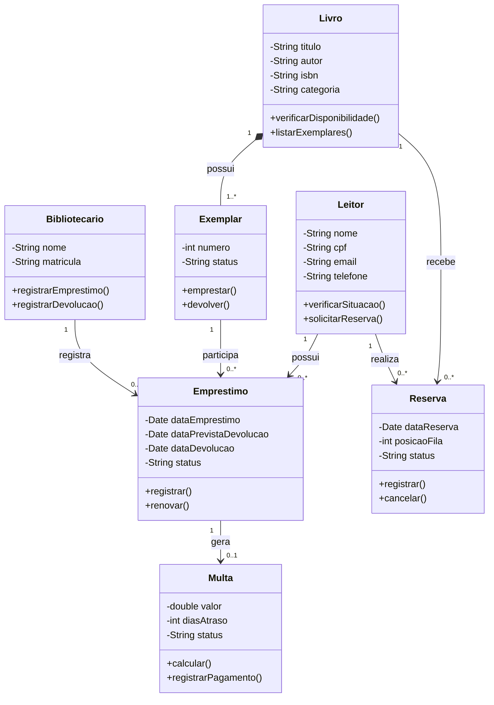
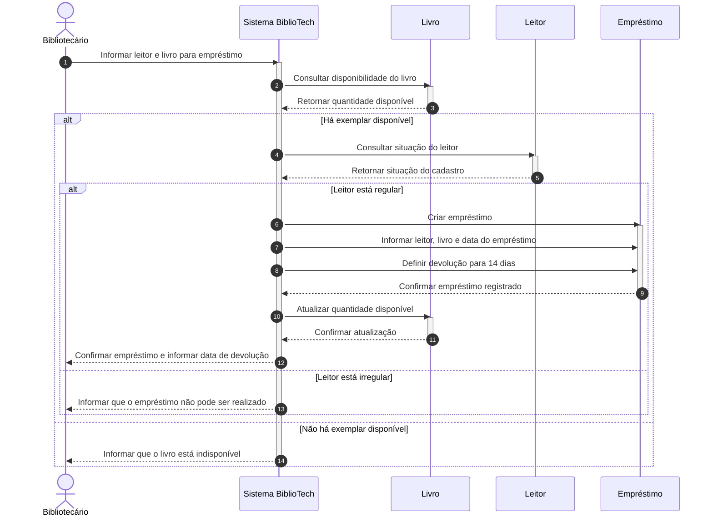
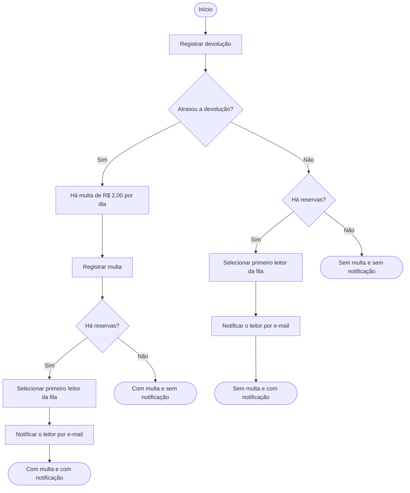

a) Diagrama de Classes


```mermaid
classDiagram

    class Livro {
        -String titulo
        -String autor
        -String isbn
        -String categoria
        +verificarDisponibilidade()
        +listarExemplares()
    }

    class Exemplar {
        -int numero
        -String status
        +emprestar()
        +devolver()
    }

    class Leitor {
        -String nome
        -String cpf
        -String email
        -String telefone
        +verificarSituacao()
        +solicitarReserva()
    }

    class Emprestimo {
        -Date dataEmprestimo
        -Date dataPrevistaDevolucao
        -Date dataDevolucao
        -String status
        +registrar()
        +renovar()
    }

    class Reserva {
        -Date dataReserva
        -int posicaoFila
        -String status
        +registrar()
        +cancelar()
    }

    class Bibliotecario {
        -String nome
        -String matricula
        +registrarEmprestimo()
        +registrarDevolucao()
    }

    class Multa {
        -double valor
        -int diasAtraso
        -String status
        +calcular()
        +registrarPagamento()
    }

    Livro "1" *-- "1..*" Exemplar : possui
    Livro "1" --> "0..*" Reserva : recebe
    Leitor "1" --> "0..*" Reserva : realiza
    Leitor "1" --> "0..*" Emprestimo : possui
    Exemplar "1" --> "0..*" Emprestimo : participa
    Bibliotecario "1" --> "0..*" Emprestimo : registra
    Emprestimo "1" --> "0..1" Multa : gera
```


b) Diagrama de Sequência - Realizar empréstimo de um livro


```mermaid
sequenceDiagram
    autonumber

    actor B as Bibliotecário
    participant S as Sistema BiblioTech
    participant L as Livro
    participant R as Leitor
    participant E as Empréstimo

    B->>S: Informar leitor e livro para empréstimo
    activate S

    S->>L: Consultar disponibilidade do livro
    activate L
    L-->>S: Retornar quantidade disponível
    deactivate L

    alt Há exemplar disponível

        S->>R: Consultar situação do leitor
        activate R
        R-->>S: Retornar situação do cadastro
        deactivate R

        alt Leitor está regular

            S->>E: Criar empréstimo
            activate E

            S->>E: Informar leitor, livro e data do empréstimo
            S->>E: Definir devolução para 14 dias
            E-->>S: Confirmar empréstimo registrado

            deactivate E

            S->>L: Atualizar quantidade disponível
            activate L
            L-->>S: Confirmar atualização
            deactivate L

            S-->>B: Confirmar empréstimo e informar data de devolução

        else Leitor está irregular

            S-->>B: Informar que o empréstimo não pode ser realizado

        end

    else Não há exemplar disponível

        S-->>B: Informar que o livro está indisponível

    end

    deactivate S
```
c) Diagrama de Atividades - Devolver livro e processar reservas


```mermaid
flowchart TD

    A([Início]) --> B[Registrar devolução]
    B --> C{Atrasou a devolução?}

    C -- Sim --> D[Há multa de R$ 2,00 por dia]
    D --> E[Registrar multa]
    E --> F{Há reservas?}

    F -- Sim --> G[Selecionar primeiro leitor da fila]
    G --> H[Notificar o leitor por e-mail]
    H --> I([Com multa e com notificação])

    F -- Não --> J([Com multa e sem notificação])

    C -- Não --> K{Há reservas?}

    K -- Sim --> L[Selecionar primeiro leitor da fila]
    L --> M[Notificar o leitor por e-mail]
    M --> N([Sem multa e com notificação])

    K -- Não --> O([Sem multa e sem notificação])
```
```
